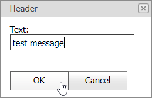

<!-- default badges list -->

<!-- default badges end -->
# Popup Control for ASP.NET Web Forms - How to add buttons to a pop-up window

This example demonstrates how to add buttons to a Popup Control's window.

## Overview

In this example, a pop-up window contains a [textbox](https://docs.devexpress.com/AspNet/11586/components/data-editors/textbox) editor with **OK** and **Cancel** [buttons](https://docs.devexpress.com/AspNet/11620/components/data-editors/button). The **Cancel** button processes the [Click](https://docs.devexpress.com/AspNet/DevExpress.Web.ASPxButton.Click?p=netframework) event on the server, while the **OK** button processes its [Click](https://docs.devexpress.com/AspNet/DevExpress.Web.ASPxButton.Click?p=netframework) event on the server and client.

<!-- default file list -->
## Files to Look At

* [Default.aspx](./CS/WebSite/Default.aspx) (VB: [Default.aspx](./VB/WebSite/Default.aspx))
* [Default.aspx.cs](./CS/WebSite/Default.aspx.cs) (VB: [Default.aspx.vb](./VB/WebSite/Default.aspx.vb))
<!-- default file list end -->

## Documentation

- [How to: Show the Default Window](https://docs.devexpress.com/AspNet/115457/components/docking-and-popups/popup-control/popup-windows/default-window)
- [How to: Show and Hide Windows](https://docs.devexpress.com/AspNet/115458/components/docking-and-popups/popup-control/popup-windows/manipulating-windows)

## More Examples

- [Popup Control for ASP.NET Web Forms - How to show and hide a pop-up window on the server side](https://supportcenter.devexpress.com/internal/ticket/details/E499)
- [Popup Control for ASP.NET Web Forms - How to show the Popup Control](https://supportcenter.devexpress.com/internal/ticket/details/E55)